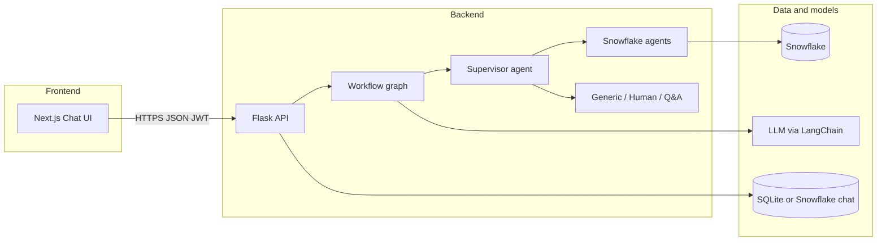

# Solenisbot

Solenisbot is a full-stack **conversational analytics assistant**: users chat in a web UI, the backend routes questions through an **LLM-orchestrated workflow**, and answers can include **natural-language summaries** and **tabular results** backed by **Snowflake** (when the query path uses the data agent). The stack pairs a **Next.js** frontend with a **Flask** Python API and is designed to align with a **Bristlecone-style** auth and chat API contract.

---

## What the application does

1. **Chat** — Users sign in (JWT), open sessions, and send messages. History can be stored in **SQLite** (default for local dev) or **Snowflake** tables (`CHAT_SESSIONS` / `CHAT_HISTORY`) when `CHAT_STORAGE=snowflake`.
2. **Orchestration** — Each user message runs through `ask_ellis_workflow_graph`: a **supervisor** agent decides which specialized agents to run (e.g. Snowflake query, generic conversation, human handoff). A **dependency resolver** orders tasks; results are merged into a **conversation** payload returned to the client.
3. **Data answers** — When the Snowflake path runs, the app can return structured rows. The **frontend** normalizes that into a real **data table** (sort, search, scroll) and can show a **Summary** tab plus **Copy** / **Download (CSV, Excel)** actions.
4. **Shortcuts** — Some user phrases are handled by **static YAML** “canned” queries (`static_sidebar_user_queries.yaml`, `static_snowflake_queries.yaml`) for fast, predictable responses without hitting the full graph.

---

## High-level architecture



---

## Repository layout

| Path | Role |
|------|------|
| `frontend/` | Next.js 15, React 19, Tailwind, Radix UI — chat interface, session list, message rendering (text + table + summary tabs), exports |
| `backend/` | Flask app, LangChain `ChatOpenAI`, agents, Snowflake connector, chat persistence, static query handlers |
| `bristlecone-backend/` | Separate/legacy backend tree (not required to run `backend/` + `frontend/` unless your team uses it) |

---

## Backend (`backend/`)

### Entry point

- **`flask_app.py`** — Flask application: CORS, JWT, health check, auth, chat CRUD, and **ask** endpoints.

### Main HTTP surface

- **Auth** — `POST /auth/register`, `POST /auth/login`, `POST /auth/refresh` (JWT).
- **Ask (legacy / compatible)** — `POST /Solenis-bot`, `POST /ask-algo`, `POST /ask-operations` — body includes `user_input`, optional `conversation_history`, optional `chat_id`, optional `response_style`.
- **REST-style chat** — `POST /api/chat/new`, `GET /api/chat/list`, `GET|DELETE /api/chat/<chat_id>`, `POST /api/chat/<chat_id>/message` — server assembles prior turns for the workflow.
- **Static questions** — `GET /get-static-user-questions` — chips + sidebar prompts from YAML.
- **Health** — `GET /health`.

### Workflow

- **`workflows/core_engine_workflow_graph.py`** — Implements `ask_ellis_workflow_graph(...)`: trims history, runs **supervisor** → **dependency_resolver** → task executors (`snowflake_agent`, `human_agent`, `generic_conversation_agent`), optional conversation summarization (gated by `WORKFLOW_ENABLE_CONVERSATION_SUMMARY`), returns a JSON-friendly result including `conversation` / `present_conversation` and agent outputs.

### Agents (selected)

| Area | Files (under `backend/agents/`) |
|------|----------------------------------|
| Core engine | `core_engine_agents/supervisor_agent.py`, `dependency_resolver_agent.py`, `q_and_a_agent.py`, `conversation_summary_agent.py`, `human_agent.py` |
| Snowflake | `snowflake_agents/snowflake_query_agent.py`, `snowflake_table_identification_agent.py` |
| Other | `generic_conversation_agent.py` |

### Supporting modules

- **`connectors/snowflake_connector.py`** — Snowflake execution.
- **`utils/snowflake_env.py`**, **`utils/snowflake_introspection.py`** — Connection helpers / introspection.
- **`utils/chat_history_handler.py`** — Session + message persistence (`CHAT_STORAGE=sqlite` default; `snowflake` when configured and tables exist).
- **`utils/prompt_loader.py`** — Loads prompt text files under `backend/prompts/`.
- **`models/azure_openai_model.py`** — Shared LangChain `ChatOpenAI` instance (API key and `OPENAI_MAX_TOKENS` from env).
- **`static/static_user_queries_handler.py`** — Maps user text to static Snowflake or canned responses.

### Python dependencies

See **`backend/requirements.txt`** (Flask, Flask-CORS, Flask-JWT-Extended, LangChain, Snowflake connector, PyYAML, etc.). Use **Python 3.11 or 3.12** for reliable wheels (see comment in `requirements.txt`).

---

## Frontend (`frontend/`)

### Stack

- **Next.js 15**, **React 19**, **TypeScript**, **Tailwind CSS**, **Radix** primitives, **Zustand** (user/session state), **Axios**.

### Entry and routing

- **`app/page.tsx`** re-exports **`app/chat/page.tsx`**, which renders **`components/chat-interface.tsx`** — primary chat experience.

### API layer

- **`lib/axiosInstance.ts`** — Base URL from `NEXT_PUBLIC_API_BASE_URL` (default `http://localhost:5000`), attaches `Authorization: Bearer` from the user store.
- **`lib/api.ts`** — Maps backend responses to **messages**: detects tabular agent output, normalizes **`TableData`**, builds dual **summary + table** presentation when the user’s phrasing implies a tabular answer, handles errors and fallbacks.

### Response presentation

- **`lib/response-formatting.ts`** — Parses markdown tables, key-value blocks, metrics, JSON arrays, etc., and builds short text summaries for table-heavy answers.
- **`lib/table-export.ts`** — CSV / SpreadsheetML (`.xls`) exports for table and summary views.
- **`components/data-table.tsx`** — Search, column sort, scrollable body (no client-side pagination).
- **`components/content-action-controls.tsx`** — Icon **Copy** and **Download ▼** (CSV / Excel) for Summary and Table tabs.
- **`components/chat-message.tsx`** — Renders assistant replies with **Summary | Table** tabs where applicable.

### Frontend env

- **`NEXT_PUBLIC_API_BASE_URL`** — Backend origin (no trailing slash required; code strips it).

---

## Configuration (environment variables)

Set these in **`backend/.env`** (and optionally a **`frontend/.env.local`** for `NEXT_PUBLIC_*`). **Do not commit secrets.**

### Backend (representative)

- **Flask / JWT** — `SECRET_KEY`, `JWT_SECRET_KEY`, `FLASK_RUN_HOST`, `FLASK_RUN_PORT`, `FLASK_DEBUG`
- **CORS** — `CORS_ORIGINS` (comma-separated)
- **LLM** — `OPENAI_API_KEY`, `OPENAI_MAX_TOKENS` (and any base URL / deployment vars your `ChatOpenAI` setup expects)
- **Snowflake** — account, user, password, warehouse, database, schema, role (see `snowflake_env` / connector usage)
- **Chat storage** — `CHAT_STORAGE=sqlite` (default) or `snowflake`; `CHAT_SQLITE_PATH` optional
- **Workflow** — `MAXIMUM_CONVERSATION_HISTORY_LENGTH`, `WORKFLOW_ENABLE_CONVERSATION_SUMMARY`, `TOKEN_EXPIRY_SECONDS`

Exact names are defined across `flask_app.py`, `chat_history_handler.py`, `core_engine_workflow_graph.py`, and connector modules — use your team’s `.env.example` if one exists.

### Frontend

- **`NEXT_PUBLIC_API_BASE_URL`** — e.g. `http://localhost:5000`

---

## Local development

### Backend

```bash
cd backend
python -m venv venv
# Windows: venv\Scripts\activate
pip install -r requirements.txt
# Configure backend/.env then:
python flask_app.py
```

Default listen: **`http://127.0.0.1:5000`** (overridable via env).

### Frontend

```bash
cd frontend
npm install
# Create .env.local with NEXT_PUBLIC_API_BASE_URL=http://localhost:5000
npm run dev
```

Open **`http://localhost:3000`** (or the port Next prints).

### Checks

```bash
cd frontend && npx tsc --noEmit && npm run lint
```

---

## How a typical message flows

1. User submits text in the chat UI.
2. Frontend calls **`POST /api/chat/<id>/message`** (or a legacy ask endpoint with inline history).
3. Flask validates input, loads recent history from SQLite or Snowflake, optionally matches **static queries**.
4. **`ask_ellis_workflow_graph`** runs agents; Snowflake branch may return row sets inside `present_conversation`.
5. Flask returns JSON; frontend **`lib/api.ts`** converts it to **`Message`** objects (text and/or `DATA_TABLE` with `tableData`).
6. UI shows **Summary** and **Table** where relevant; user can copy or export.

---

## License and ownership

Add your organization’s license and contribution guidelines here if this repository is shared beyond your team.
